# NOTE:
### PSKU

#### DOWNLOAD
- Download Path MASA/MASA report templates/Missing PSKU Report
- Set the duration **1 month** ***(Current month)*** 
    - **NOTE: First day of the month (ex: sept 1 up to current date)**
    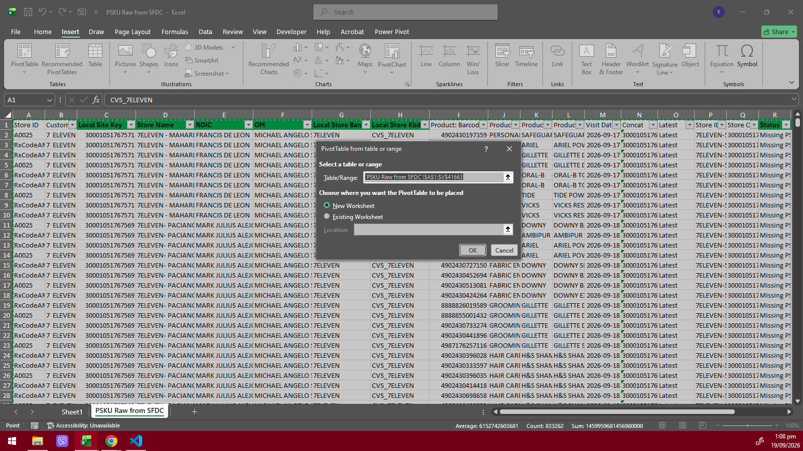

#### CREATION OF REPORT
- After downloading the PSKU raw, clean all the data that necessary to clean such as **Visit Date, Product barcode text** and also copy the **Store ID** and paste it in the first colomn, coz that **ID** will use to the populating Data.
    - Raw Data
    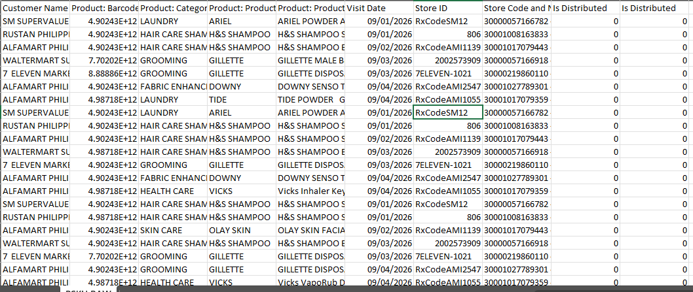
    - After Cleaning 
    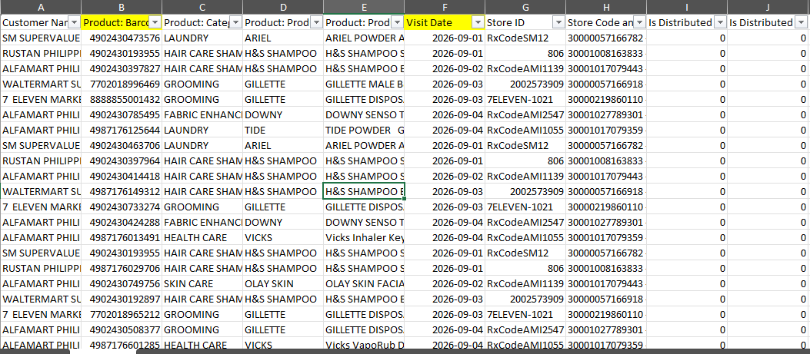
- After that, add the necessary Data ***(Local Site Key, Store Name, ROIC, OM,  Local Store Banner, Local Store KBD Cluster Name)*** and ***populate it*** using **Store ID** to **MDM**
    - Added column
    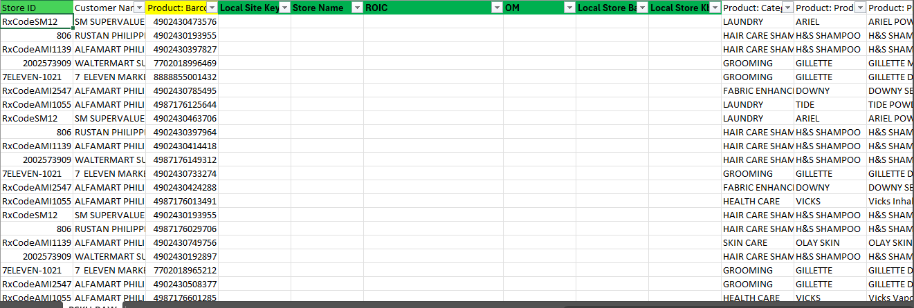
    - Populated
    
- After that you can add the following ***COLUMNS (Status, Target, Distributed, Missing PSKU, Count of Store, and the Latest)***
    - **NOTE: if you do the **PSKU** report all data in raw SFDC file will mark as STATUS: MISSING PSKU, TARGET: 1, DISTRIBUTED: blank, MISSING PSKU: 1. and keep the Latest column blank you will be populate that column using concat and vlookup**
    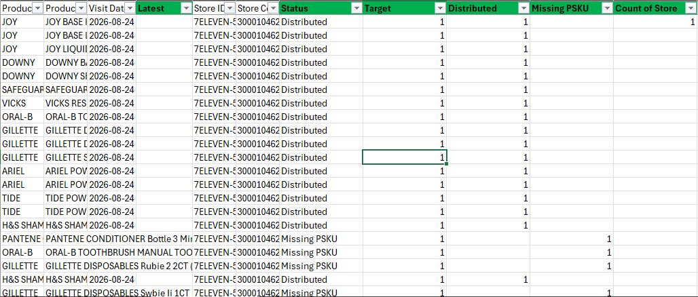
- After that, just ***select all the columns*** and create a **PIVOT table and display Local Site Key, and Visit Date** and create a concat column and the remark column
    - 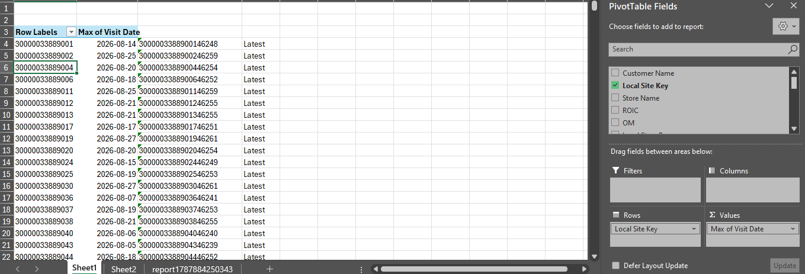
- Go back to the raw Data and create the concat column beside the column Latest, and the value of the concat column is concatinated **Local Site Key, and Visit Date** get the ***Latest*** value in ***PIVOT*** using **Vlookup** and just paste all the function to intire column
    - Getting the Latest Value 
    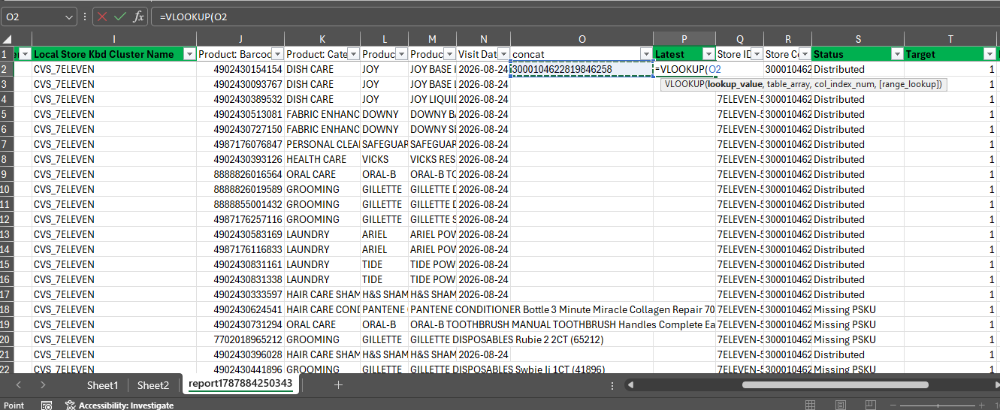
    - Function pasted to entire column
    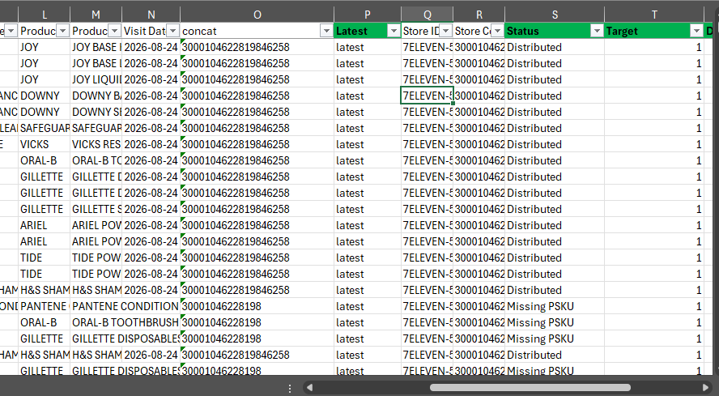
- After that create **PIVOT** again, just ***CRL+A*** and create a **PIVOT** to get a **Mapper Data** but this time the columns that you need is **Local Site Key, Product: Barcode Text and Product: Category** and create a concat column and like True of false column, then concatinate the 3 columns **Local Site Key, Product: Barcode Text and Product: Category** and just put a ***1*** value in true or false column
    - Creating **PIVOT** 
    
    - Columns needed
    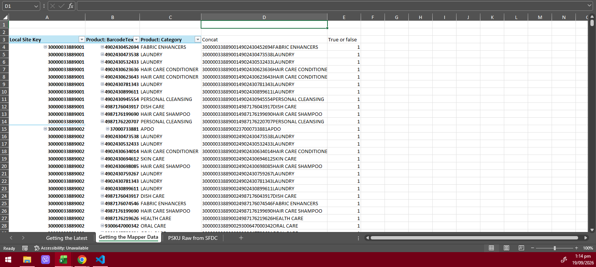
- After that open your ISKU and PSKU mapper and copy all the **CON** value and paste it in your **PIVOT** that ***created earlier***
    - Opening and copying the **CON** column
    - ***NOTE: Make sure you choose the PSKU sheet not ISKU, the Sheet located in BOTTOM LEFT of excel, the GREEN is the PSKU and the YELLOW is the ISKU***
    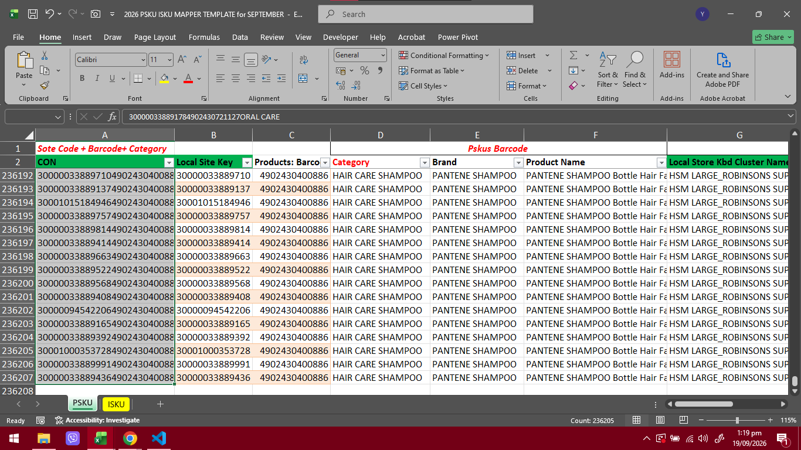
    - Pasting the data that copied from ***PSKU iSKU Mapper***
    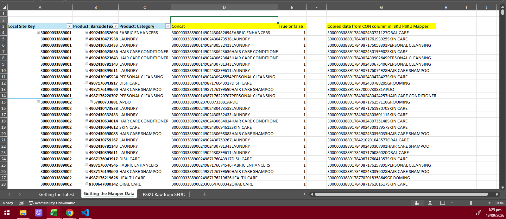
- Next get all the ***N/As*** by comparing the ***concatinated*** value in your raw data and ***concatinated*** data from your **ISKU PSKU Mapper** using ***Vlookup***
    - Functions to see the column that need to lookup
    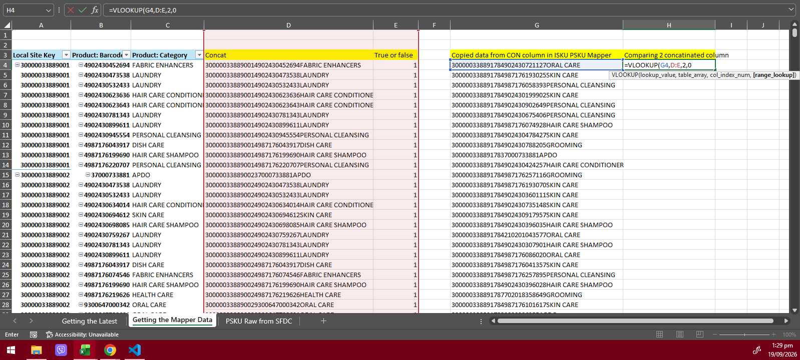
    - Getting the ***N/As*** using **vlookup**
    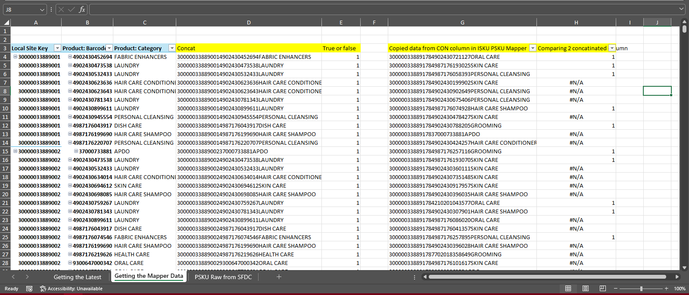
- As you can see, there's value ***1*** that you get in the earlier ***VLOOKUP*** the meaning of that is that item is already exist in your raw data, so you can ignore that and get sa ***N/As*** only, coz the ***PURPOSE*** of that **VLOOKUP** is to get the item that ***DOESN'T*** exist in your **RAW DATA**, so just **FILTER** that column and choose only the ***N/As*** then copy all the ***N/As*** then ***paste*** it in the end of your ***Raw data*** and ***DELETE*** the value of ** STORE ID** that you copy earlier to ***populate*** the necessary columns including the ***header***
    - Filtering the ***N/As***
    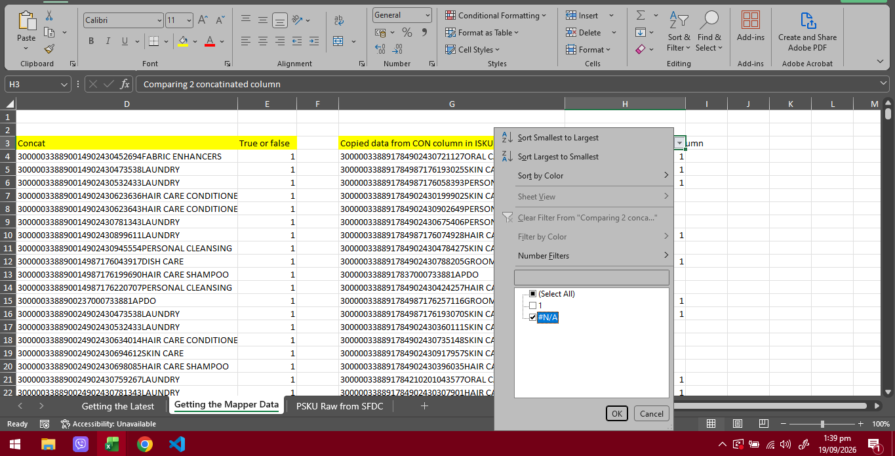
    - Copying all the ***N/As***
    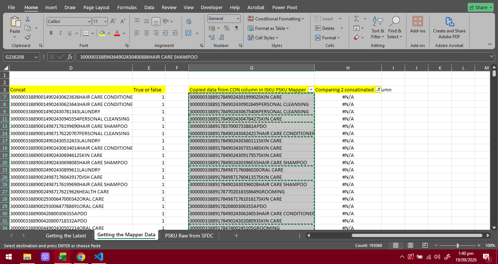
    - Pasting all copied data from **PIVOT**
    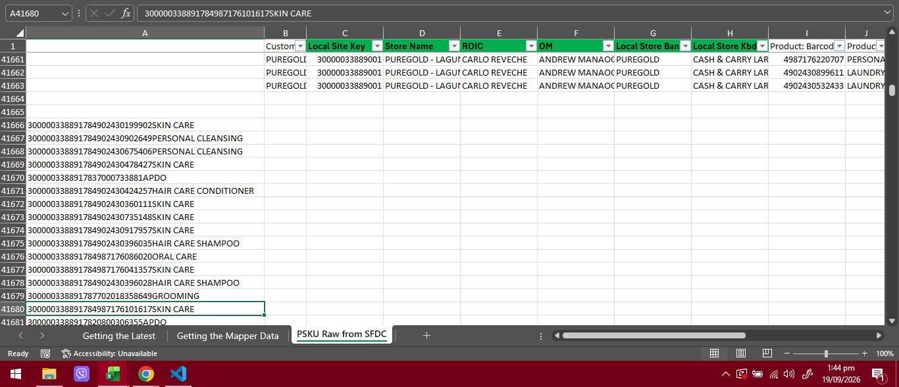