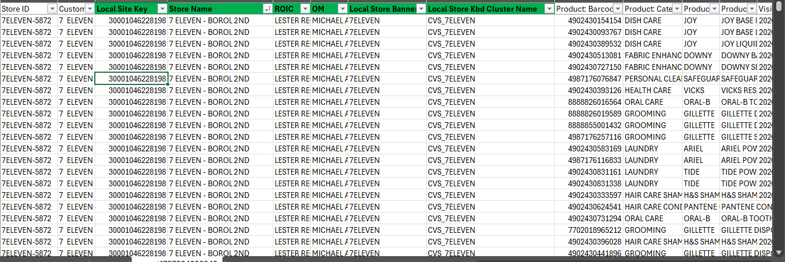
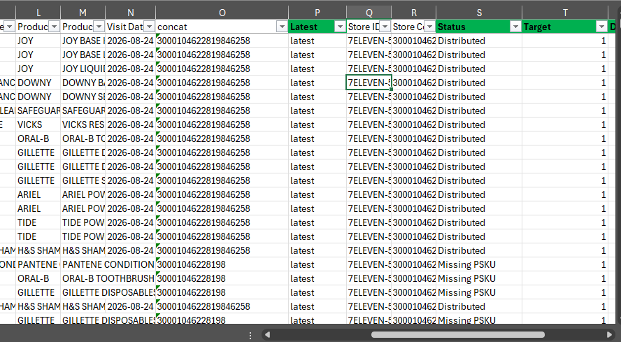

# NOTE:
### PSKU

#### DOWNLOAD
- Download Path MASA/MASA report templates/Missing PSKU Report
- Set the duration **1 month** ***(Current month)*** 
    - **NOTE: First day of the month (ex: sept 1 up to current date)**
    

#### CREATION OF REPORT
- After downloading the PSKU raw, clean all the data that necessary to clean such as **Visit Date, Product barcode text** and also copy the **Store ID** and paste it in the first colomn, coz that **ID** will use to the populating Data.
    - Raw Data
    
    - After Cleaning 
    
- After that, add the necessary Data ***(Local Site Key, Store Name, ROIC, OM,  Local Store Banner, Local Store KBD Cluster Name)*** and ***populate it*** using **Store ID** to **MDM**
    - Added column
    
    - Populated
    
- After that you can add the following ***COLUMNS (Status, Target, Distributed, Missing PSKU, Count of Store, and the Latest)***
    - **NOTE: if you do the **PSKU** report all data in raw SFDC file will mark as STATUS: MISSING PSKU, TARGET: 1, DISTRIBUTED: blank, MISSING PSKU: 1. and keep the Latest column blank you will be populate that column using concat and vlookup**
    
- After that, just ***select all the columns*** and create a **PIVOT table and display Local Site Key, and Visit Date** and create a concat column and the remark column
    - 
- Go back to the raw Data and create the concat column beside the column Latest, and the value of the concat column is concatinated **Local Site Key, and Visit Date** get the ***Latest*** value in ***PIVOT*** using **Vlookup** and just paste all the function to intire column
    - Getting the Latest Value 
    
    - Function pasted to entire column
    