# NOTE
## SOS and SOD NOTES

### SOD duration 
- Every 15 Days
- File have a million columns so download the files every 5 days duration then combine it into 1 file,

### PROCEDURE HOW TO CREATE SOD REPORT
 #### DOWNLOAD :
- First download the file **MASA -> Copy - VGP SOD w Display Type**
- FIlter the **Visit date** in SFDC when you download the file since 15 days that the report needs, filter it 5 days per file coz this file is to large ***(a million colums)***
- Look at the filtered date in these 3 Pictures.

#### CREATION :
- Remove the Dummy in column ***Market Measure Master: Name***

- Select all ***Dummy*** and **Delete the Row**

- Dummy Deleted
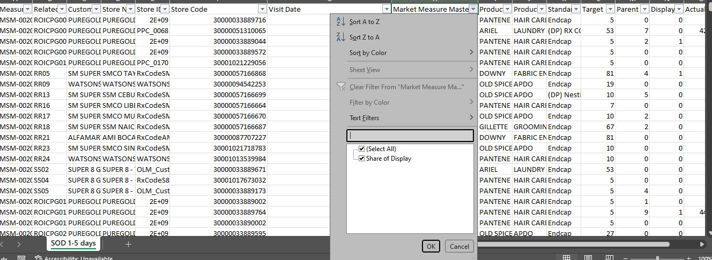
- Clean the data "Visit Date, Store codes"

- After Cleaning 
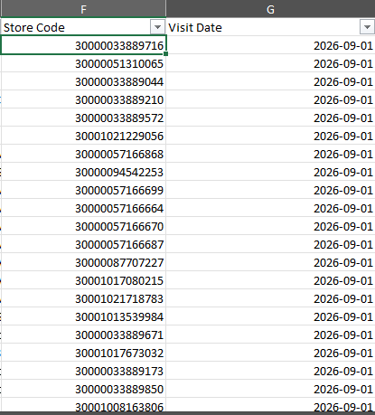
- After cleaning. make sure to look for the visit date and make sure that the only month there is the current month and the day is the day that you filter in SFDC
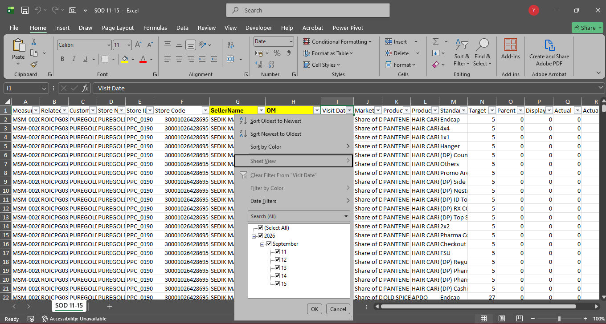
- Next Create 2 columns **Seller name and OM** and populate the data from MDM using the ***Store code*** that **raw data** provided

- After populate the columns, see the N/A **NOTE: the N/As means the outlet is not our account**
- Select all the columns and row and Create a **Pivot table** to get a **Latest**
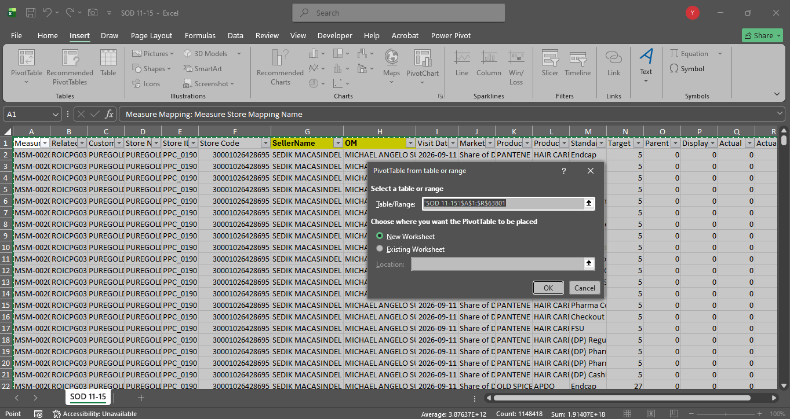
- Inside the pivot table display the **STORE CODE, Product Category: Product Hierarchy Name, Standard List Master : List Name. and VISIT DATE**
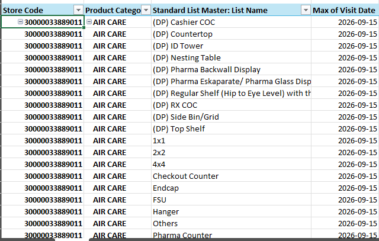
- then create a **Concatinate, Latest column** then concat the **STORE CODE, Product Category: Product Hierarchy Name, Standard List Master : List Name. and VISIT DATE**
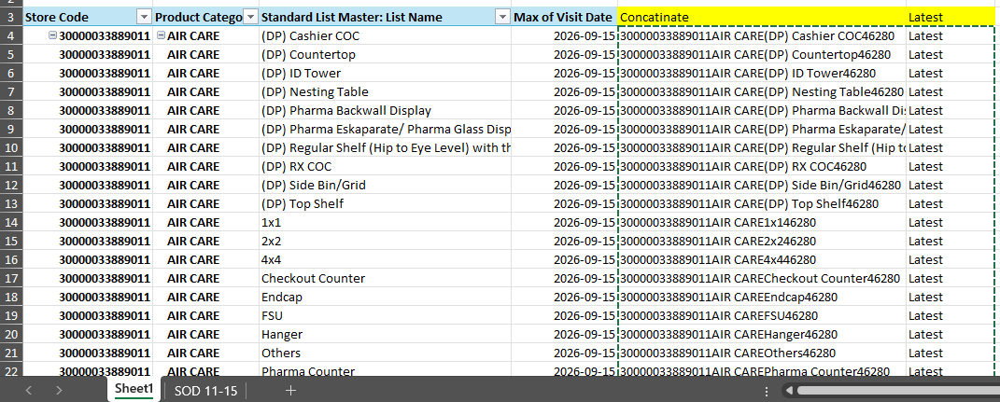
- Go back to the Raw data and create **Concatinate, Latest column**
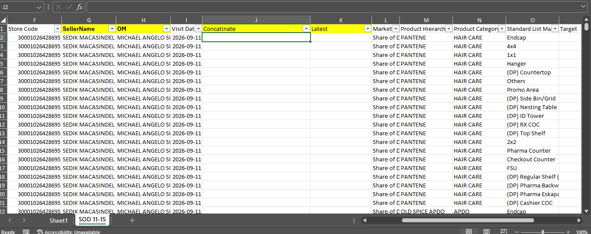 
- Then Concat the column **STORE CODE, Product Category: Product Hierarchy Name, Standard List Master : List Name. and VISIT DATE** to get the Latest value
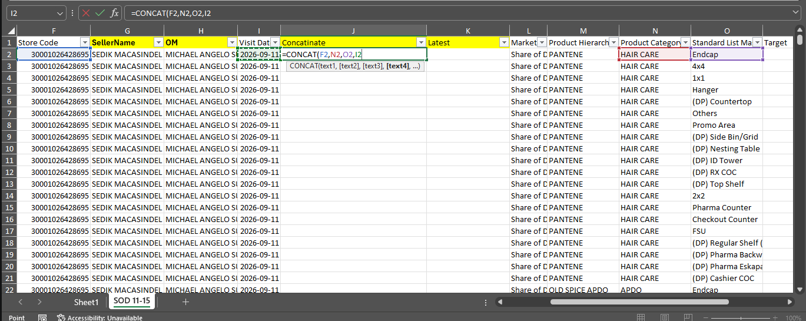
- After that ***Vlookup*** the Latest column with the **Created Pivot**
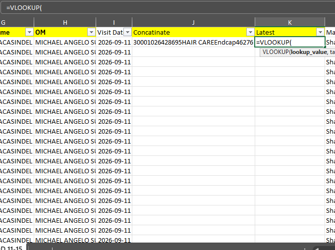
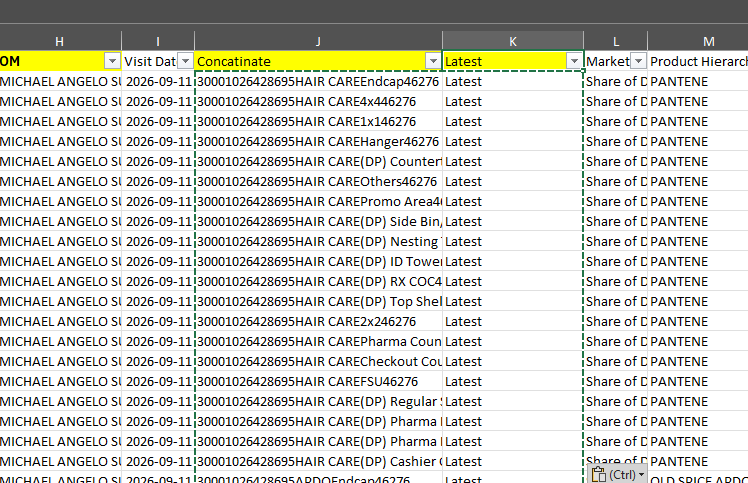
- after that Look for the N/As NOTE: Why reason there's a N/As coz that account is not one of our account. and Just delete it
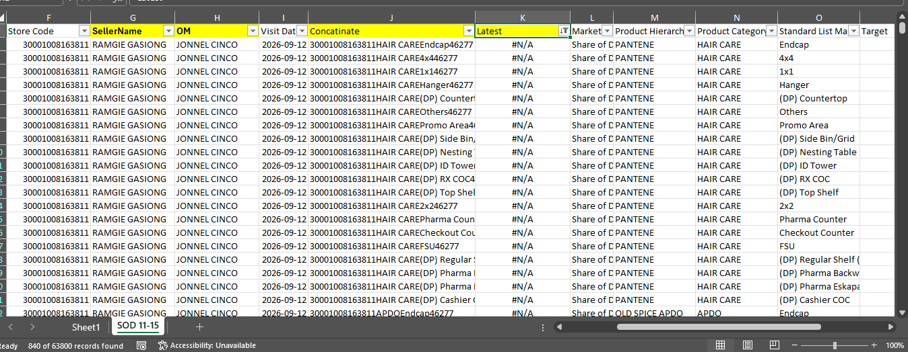
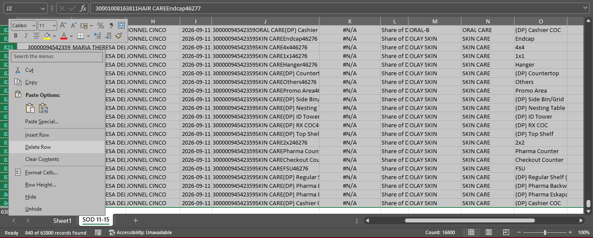
- after you deleted the N/As just copy all the data into work sheet that you will paste all the clean data from the 3 files you downloaded from SFDC