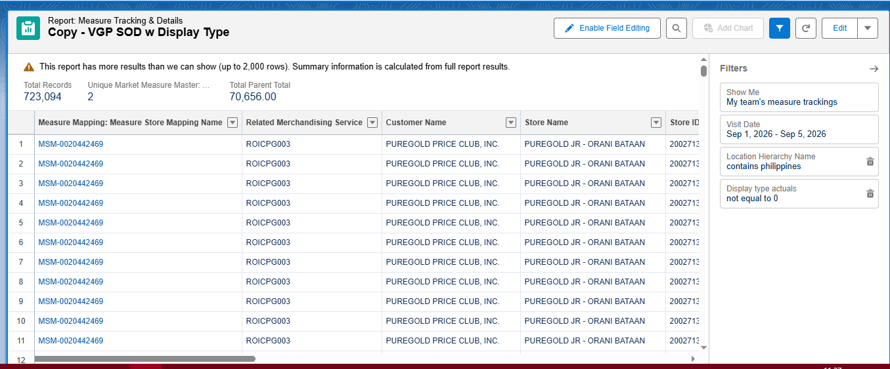
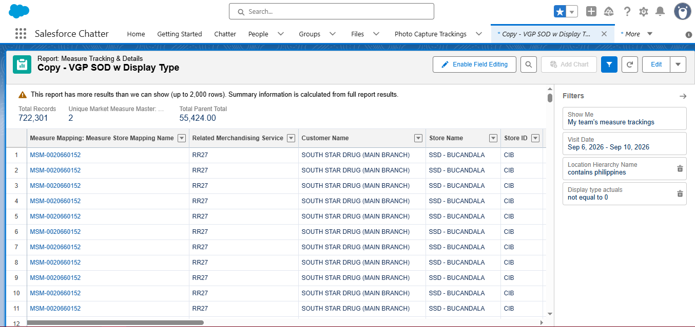
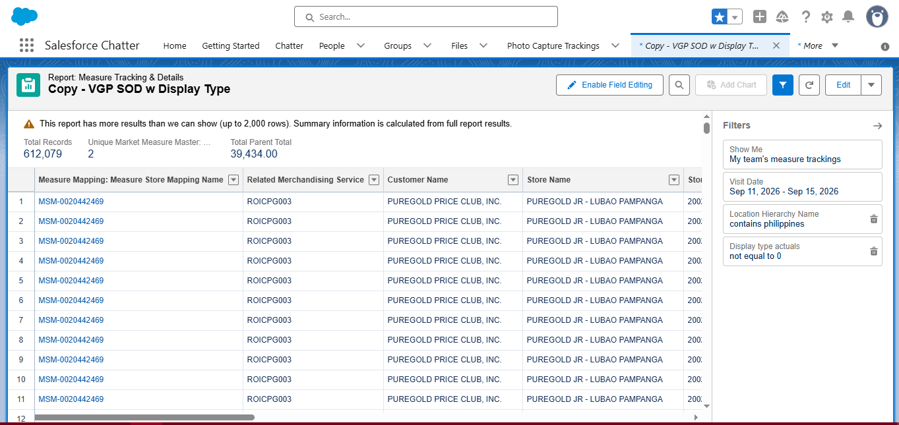
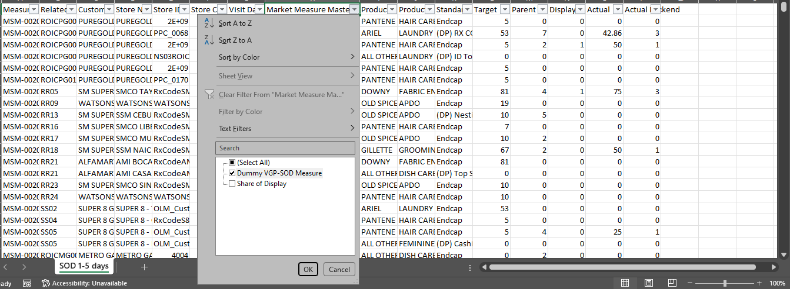
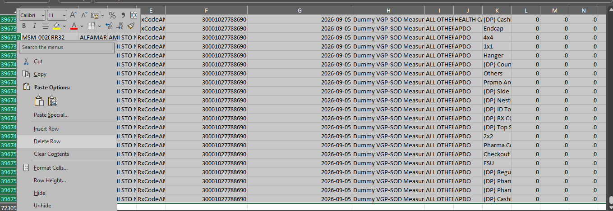
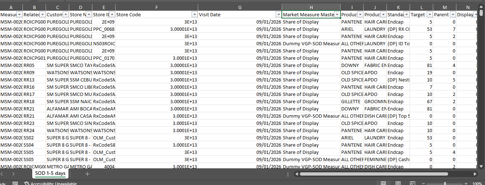
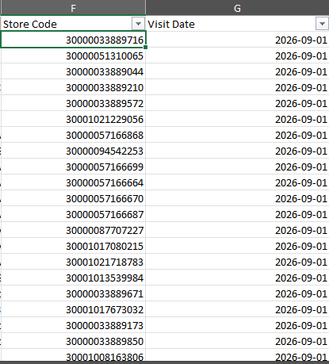

# NOTE
## SOS and SOD NOTES

### SOD duration 
- Every 15 Days
- File have a million columns so download the files every 5 days duration then combine it into 1 file,

### PROCEDURE HOW TO CREATE SOD REPORT
 #### DOWNLOAD :
- First download the file **MASA -> Copy - VGP SOD w Display Type**
- FIlter the **Visit date** in SFDC when you download the file since 15 days that the report needs, filter it 5 days per file coz this file is to large ***(a million colums)***
- Look at the filtered date in these 3 Pictures.

#### CREATION :
- Remove the Dummy in column ***Market Measure Master: Name***

- Select all ***Dummy*** and **Delete the Row**

- Dummy Deleted

- Clean the data "Visit Date, Store codes"

- After Cleaning 

- Create 2 columns **Seller name and OM** and populate the data from MDM using the ***Store code*** that **raw data** provided
- After populate the columns, see the N/A **NOTE: the N/As means the outlet is not our account**
- Create a **Pivot table** to get a **Latest**
- Inside the pivot table display the **STORE CODE, VISIT DATE**
then create a **Concatinate, Latest column** then concat the **STORE CODE, VISIT DATE**

- Go back to the Raw data and create **Concatinate, Latest column** 